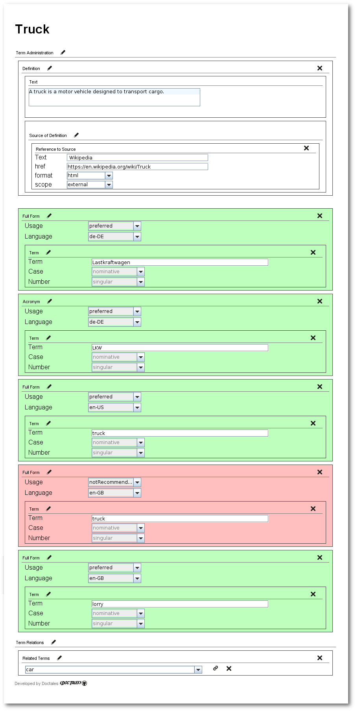
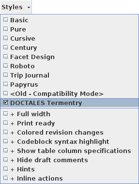
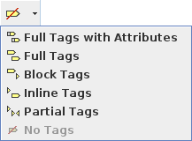
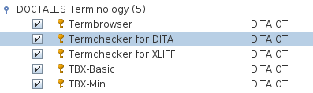
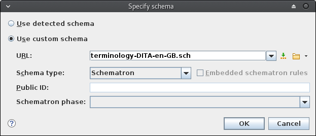
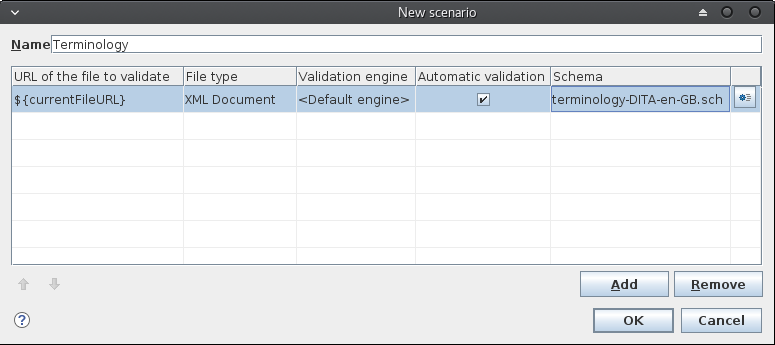
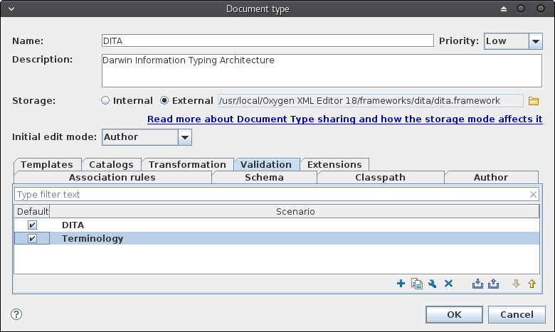
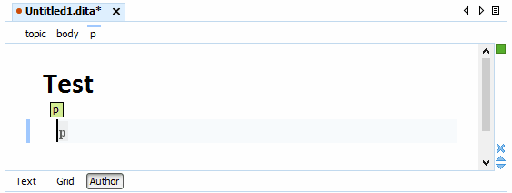
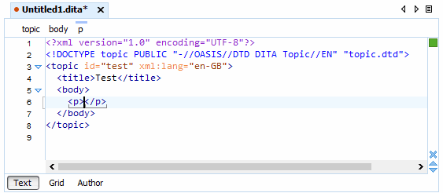
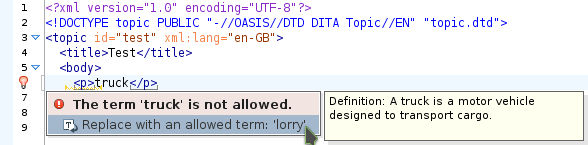

- - - -

org.doctales.terminology 
========================

[](https://travis-ci.org/doctales/org.doctales.terminology)
[](http://www.apache.org/licenses/LICENSE-2.0)

**org.doctales.terminology** is a plugin for the [DITA-OT](http://dita-ot.github.io) for creating a DITA-based terminology database.
The plugin contains a new DITA `<termentry>` topic type. This topic type represents a single term.
The plugin also contains an &lt;oXygen/&gt; XML authoring framework. The authoring framework simplifies editing `<termentry>` topics.

**Table of Contents**

* [Features](#features)
* [Installation](#installation)
* [Install Framework](#install-framework)
  * [&lt;oXygen/&gt; Author Mode Stylesheet](#oxygen-author-mode-stylesheet)
    * [Activate &lt;oXygen/&gt; Author Mode Stylesheet](#activate-oxygen-author-mode-stylesheet)
* [Usage](#usage)
  * [DITA Termchecker](#dita-termchecker)


### Features

- Specialized DITA `termentry` topic
- &lt;oXygen/&gt; XML framework with author mode stylesheet
- Transformation scenario for generating a terminology checker
- Transformation scenario for generating a terminology browser
- Transformation scenario for exporting the terminology to TBX-Min for your Language Service Provider (LSP)
- Transformation scenario for exporting the terminology to TBX-Basic for your Language Service Provider (LSP)


### Installation

You can install the plugin to the DITA-OT with the following command:

```bash
dita -install https://github.com/doctales/org.doctales.terminology/archive/master.zip
```


### Install Framework

This step is optional. To install the &lt;oXygen/&gt; XML framework, proceed as follows:

1. In &lt;oXygen/&gt; open the menu `Options` > `Preferences`.
2. In the preferences, open `Document Type Association` > `Locations`.
3. Add the directory of the plugin.
   


#### &lt;oXygen/&gt; Author Mode Stylesheet

**org.doctales.terminology** ships an &lt;oXygen/&gt; XML framework that contains an &lt;oXygen/&gt; XML author mode stylesheet.
The stylesheet simplifies authoring `<termentry>` topics. The stylesheet is available in the following languages:

- English
- German


#### Example

The following code snippet shows the sample file `truck.dita`.

```xml
<?xml version="1.0" encoding="UTF-8"?>
<!DOCTYPE termentry PUBLIC "-//DOCTALES//DTD DITA DOCTALES Termentry//EN" "termentry.dtd">
<termentry id="truck">
  <title>Truck</title>
  <definition>
    <definitionText>A truck is a motor vehicle designed to transport cargo.</definitionText>
    <definitionSource>
      <sourceReference href="https://en.wikipedia.org/wiki/Truck" 
                       format="html" 
                       scope="external">
        Wikipedia
      </sourceReference>
    </definitionSource>
  </definition>
  <termBody>
    <fullForm language="de-DE" usage="preferred">
      <termVariant>Lastkraftwagen</termVariant>
    </fullForm>
    <acronym language="de-DE" usage="preferred">
      <termVariant>LKW</termVariant>
    </acronym>
    <fullForm usage="preferred" language="en-US">
      <termVariant>truck</termVariant>
    </fullForm>
    <fullForm language="en-GB" usage="notRecommended">
      <termVariant>truck</termVariant>
    </fullForm>
    <fullForm usage="preferred" language="en-GB">
      <termVariant>lorry</termVariant>
    </fullForm>
  </termBody>
  <relations>
    <relatedTerms>
      <relatedTerm keyref="car"/>
    </relatedTerms>
  </relations>
</termentry>
```

The screenshot shows the same file rendered with the &lt;oXygen/&gt; XML author mode stylesheet.




#### Activate &lt;oXygen/&gt; Author Mode Stylesheet

1. Choose the style **DOCTALES Termentry** in the **Styles** menu.<br/>
   
2. Turn of all tags in the **Tags** menu.<br/>
   


### Usage

**org.doctales.terminology** ships a few sample files, that show you how to create terms and create the various outputs.

* [DITA Termchecker]


#### DITA Termchecker

The DITA Termchecker is technically a [Schematron](http://www.schematron.com) file, 
that searches for deprecated terms and replaces deprecated terms with preferred ones.

1. Open the samples DITA map `~/org.doctales.terminology/samples/terminology.ditamap` in the &lt;oXygen/&gt; DITA Maps Manager.
2. In the `Transformation Scenarios` view, double click the entry `Termchecker for DITA`.<br/>
   <br/>
   The terminology is transformed to the Schematron file `~/out/termchecker-dita/terminology-DITA-en-GB.sch`.
   By default, the terminology checker is generated for British English (`en-GB`).
   If you want to generate the terminology checker for another language, you have to change the parameter `args.language` of the transformation scenario.
3. Create a new DITA validation scenario and refer to the generated Schematron file.
   1. In &lt;oXygen/&gt; open the menu `Options` > `Preferences`.
   2. In the `Document Type Association` menu, select the `DITA` document type association and click the button `Edit`.
   3. Open the `Validation` tab and click the **+** button, to create a new validation scenario.
   4. Create a new validation scenario named `Terminology` and specify the Schematron schema.<br/>
      <br/>
      <br/>
      <br/>
4. Create a new DITA topic.
5. Set the `xml:lang` attribute of the topic to `en-GB` and write the word `truck` somewhere in the topic.<br/>
   The term violation is indicated with a small lamp icon . 
   This works both in text and in author mode.<br/>
   <br/>
   <br/>
6. Click on the lamp select the `Replace with an allowed term` action.
   <br/>
   The deprecated term has been replaced.

**Explanation**

The deprecated and the allowed term notations are defined in the `truck.dita` file.

```xml
<fullForm language="en-GB" usage="notRecommended">
  <termVariant>truck</termVariant>
</fullForm>
<fullForm usage="preferred" language="en-GB">
  <termVariant>lorry</termVariant>
</fullForm>
```

> **Note**
> 
> You can also generate the Schematron file using the `dita` command:
> 
> ```bash
> dita -i terminology.ditamap -f termchecker -Dargs.language=en-GB -o termchecker-dita
> ```
